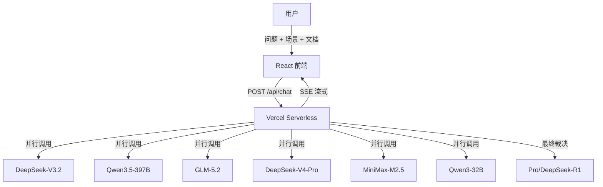

# Perspective Council 视角委员会

> 多智能体共创系统 — 让不同思维框架碰撞出更好的决策

## 概述

Perspective Council 是一个基于多 AI 模型的讨论系统。用户只需输入问题并选择场景，系统会自动组建 4-6 位"智能委员"（每位使用独立的大模型），按照结构化讨论协议进行多轮辩论，最终输出决策建议。

**底层逻辑对用户完全透明** — 你只需要关注问题本身。

## 架构



## 讨论协议（5轮）

| 轮次 | 名称 | 说明 |
|------|------|------|
| R1 | 独立陈述 | 各委员并行给出独立判断 |
| R2 | 交叉质询 | 选择最不同意的委员提出质疑 |
| R3 | 回应修正 | 回应质疑，坚持或修正立场 |
| R4 | 共识凝练 | 主席总结共识区与分歧区 |
| R5 | 裁决建议 | 独立裁决官提炼决议选项 |

## 共创场景

| 场景 | 委员配置 |
|------|---------|
| ✨ 产品策划 | 俞军、克里斯坦森、贝佐斯、张一鸣、乔布斯 |
| ⚙️ 商业机制设计 | 贝佐斯、芒格、曾鸣、达利欧、俞军 |
| 🎯 平台战略 | 曾鸣、克里斯坦森、贝佐斯、塔勒布、达利欧 |
| 📈 增长策略 | 贝佐斯、俞军、Naval、曾鸣、芒格 |
| ⚠️ 风险评估 | 芒格、塔勒布、达利欧、克里斯坦森、贝佐斯 |
| 📊 向上汇报 | 贝佐斯、费曼、马斯克、阿莫 |
| 🤖 AI产品落地 | Karpathy、俞军、张一鸣、克里斯坦森、塔勒布 |
| 🏢 组织设计 | 达利欧、贝佐斯、张一鸣、芒格、Naval |
| 🤝 客户经营 | 俞军、贝佐斯、克里斯坦森、曾鸣、达利欧 |
| ✍️ 内容与传播 | PG、费曼、乔布斯、MrBeast |

## 技术栈

- **前端**: React 18 + Vite 5 + Tailwind CSS 3
- **后端**: Vercel Serverless Functions
- **AI**: SiliconFlow API（7个模型防舞弊架构）
- **流式输出**: Server-Sent Events (SSE)
- **UI**: Apple 极简风，暗/亮主题

## 本地开发

```bash
# 克隆项目
git clone https://github.com/your-username/perspective-council.git
cd perspective-council

# 安装依赖
npm install

# 配置环境变量
cp .env.example .env.local
# 编辑 .env.local 填入 SiliconFlow API Key

# 启动开发服务器
npm run dev
```

## 环境变量

| 变量名 | 说明 |
|--------|------|
| `SILICONFLOW_API_KEY` | SiliconFlow 平台 API Key |

## 部署至 Vercel

1. Fork 本仓库
2. 在 Vercel 中导入项目
3. 设置环境变量 `SILICONFLOW_API_KEY`
4. 部署完成

`vercel.json` 已配置好路由重写和函数超时时间（120s）。

## 功能特性

- 🎭 **10个共创场景** — 覆盖产品/战略/增长/风险等决策场景
- 📄 **文档上传** — 支持 TXT/MD/CSV 格式，为讨论提供背景材料
- 🌓 **暗/亮主题** — 跟随系统或手动切换，localStorage 持久化
- ⚡ **三种模式** — 快速(3轮)/标准(5轮)/深度(7轮)
- 📡 **流式输出** — SSE 逐轮推送，实时看到讨论进展
- 🔒 **API安全** — Key 仅存于服务端环境变量，前端零暴露

## License

MIT
